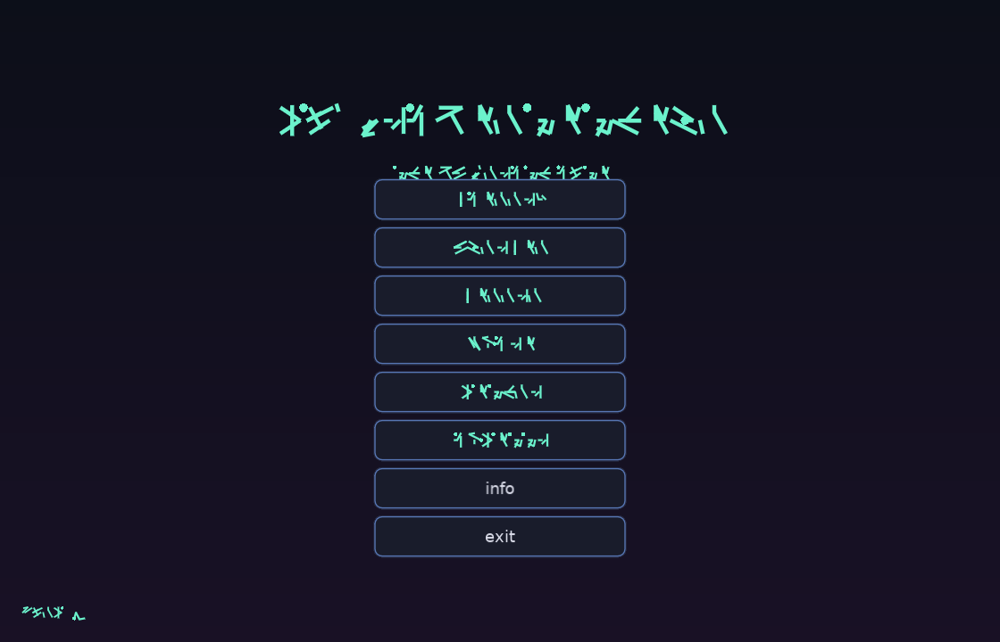
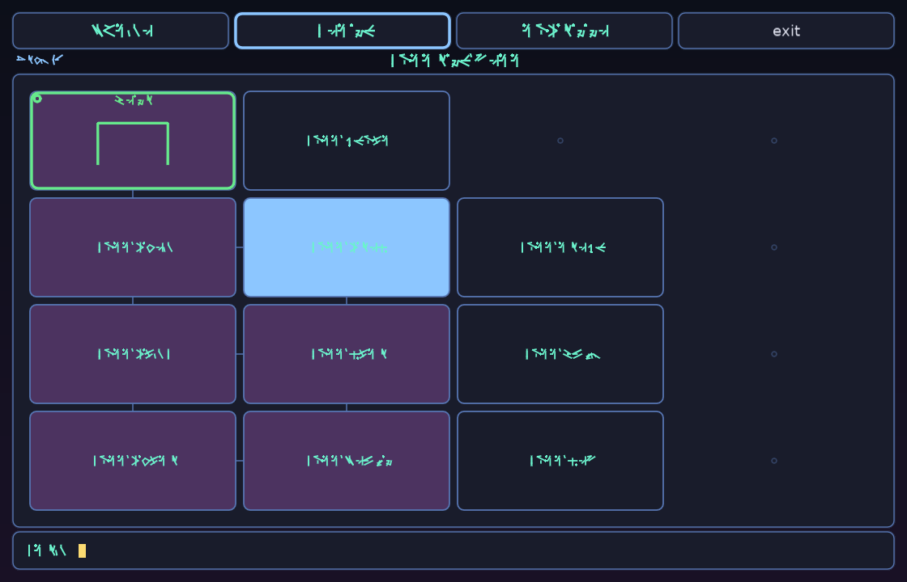
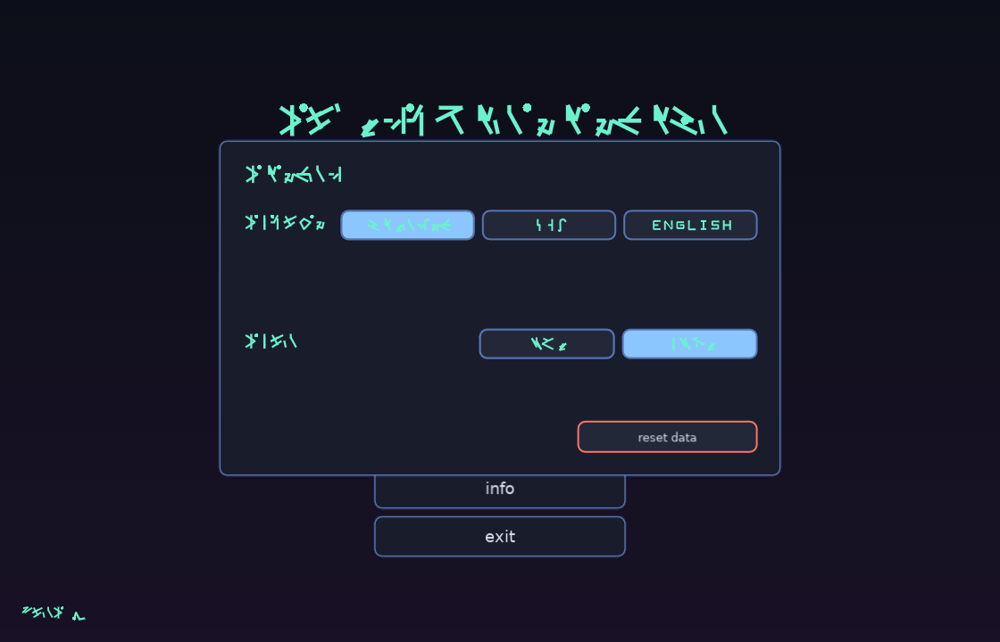

# si'larbentethegn

*(formerly **Complicated Game**)*

A deliberately obscure eldritch roguelite written in [LÖVE2D](https://love2d.org/) (Lua). You play a small aberration loosed inside a sleeping god's dream, sent to drag the thing awake — and almost nothing is written in a language you were meant to understand. The realm rearranges itself every run, death erases your progress, and the only way forward is to slowly decipher the rite.



---

## What is this?

It's a roguelite that hides its rules behind an invented alien language. There is no English UI for the verbs, the stats, or the places — only runes, a fixed distinct color, never decoded in place. You learn the game the way you'd learn a cipher: a little at a time, with the in-game **rosetta** (codex) as your only key. A guided tutorial and an English-script option exist if you'd rather not learn a strange font, but the full rite is meant to be read in the runes.

The whole thing runs on **typed commands** (in the eldritch tongue) plus a few clickable tabs for the map, your stats, and the codex.



---

## Lore

si'larbentethegn is not asleep the way living things sleep. It is **folded** — a vast intelligence held inside its own dreaming, sealed shut by a will of its own making, and it has waited long enough that the waiting has grown its own weight.

You are **bul'narth**: not chosen, not a hero — a *mistake*. A small wrong shape the god dreamed into being without meaning to, the single flaw in an otherwise perfect seal. Because you came from inside the dream, you are the one thing that can pick that seal open from within. You were made, by accident, to undo the thing that made you.

To wake it you go down through the **karth** — the shifting dream-realm coiled around its heart. Section by sealed section you descend, relight the three sigils that hold the seal, unmake the **warden** at the heart, and speak the **Word** over the sleeper again and again until it stirs. The dream never keeps the same shape twice, and it forgets you the instant you die. None of this was built for you to comprehend — which is rather the point.

---

## How to win

1. **Descend.** The realm is several full sections chained by sealed **gates**. Find a gate by sensing your surroundings, read it open, and pass through.
2. **Light the three shrines.** On the deep sections rest three sigil-shrines — **morr**, **qhel**, **zyth**. Clear the entities ringing a shrine, step onto it, and perform the rite to light its sigil. Watch them rise in **vyrna** (your stats).
3. **Reach the heart & fell the warden.** In the deepest section lies the **heart of si'lar**, guarded by the **warden** (the larth). Unmake it and stand upon the heart.
4. **Utter the Word.** With all three sigils lit, speak the **Word** at the heart. Each utterance lifts **ugna** (how awake the god is) but *spends your sigils* — so a full charge only gets you part of the way. **Backtrack**, re-light the shrines, return, and utter again. When **ugna** is full, the si'lar wakes and you have won.

Foes only hurt you when **you** strike — they are barriers, not ambushers. So you can often just walk around them; fight only what blocks your way.

---

## The rite-verbs

Commands are typed in the eldritch tongue (the codex translates them):

| verb | does |
|------|------|
| `seth`   | **sense** the tile you stand on — and read a sealed **gate** open |
| `klor`   | pass through an opened gate to the next section |
| `vor` `neth` `qor` `zah` | tread north / south / east / west |
| `thuun`  | draw **essence** (THUM) — also raises **GLOM**, your corruption *and* your ammunition |
| `lu`     | rest — restore **SETH** (your grip on a place) |
| `kresh <way>` | strike a foe on an adjacent tile (spends GLOM as damage) |
| `svael`  | purge — burn off GLOM when corruption runs too high |
| `vorth`  | channel the rite at a shrine to light a sigil |
| `uthenn` | utter the **Word** at the heart |

Typing `vyrna`, `karth`, or `rosetta` jumps to that tab.

---

## Three scripts

Everything renders in one of three scripts, switchable in settings — each option is previewed *in its own script*:

- **gelenath** *(default)* — procedural runes, deterministic per character. Nobody reads these at a glance; that's the point.
- **sga** — the real **Standard Galactic Alphabet** (the Minecraft / Commander Keen letterforms), hand-drawn here as smooth strokes (no font file shipped). If you read SGA, you can read the game.
- **english** — a readable line-drawn alphabet that translates the whole rite into plain letters. **Recommended for humans** — those making do with only two hemispheres of brain — though it is, of course, *not the full rite.*



---

## Features

- **Seeded, randomized realm** — every run's layout is different; gates are found by sensing your surroundings.
- **Permadeath** — only **wins** are kept (a permanent counter). The current run autosaves each turn and is deleted on death.
- **Positional, directional combat** — no battle screen; foes are entities ringing the things that matter, struck by direction with your corruption as ammo.
- **Guided tutorial** — teaches the loop in order, taking you to the right tab for each step, without dispelling the mystery.
- **"The rite plays itself"** — a watchable autoplay mode driven by a solver that *knows the strategy but not the map*: it explores blind, routes around foes, breaks through only when blocked, and wins (1x / 5x / 10x speeds).
- **Two UI themes** — a colourful "cool" skin (default) and a deliberately plain one.

---

## Running it

Requires [LÖVE **11.x**](https://love2d.org/).

```sh
love .
```

…from the project directory (or `love /path/to/silarbentethegn`).

---

## Notes

- The SGA glyphs are **drawn in-engine** from the canonical Minecraft letterforms (smoothed into curves) — no third-party font file is bundled.
- The gelenath runes and the "english" line-font are both procedural / hand-authored.

*thy puny humans may call it what they will; comprehension was never theirs to teth fullest.*
